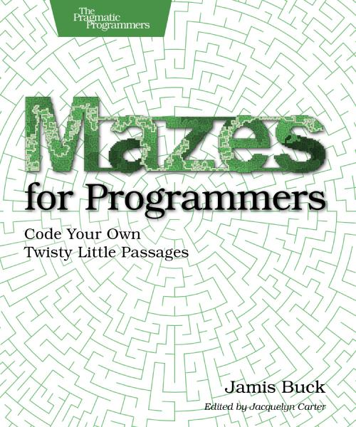

# Mazes for Programmers
Code Your Own Twisty Little Passages

## Java Implementation

In the book *Mazes for Programmers* a Ruby implementation is given, but it can be implemented in many different programming languages. This repository contains a Java implementation.

## About the Book

A book on mazes? Seriously?

Yes!

Not because you spend your day creating mazes, or because you particularly like solving mazes.

But because it’s fun. Remember when programming used to be fun? This book takes you back to those days when you were starting to program, and you wanted to make your code do things, draw things, and solve puzzles. It’s fun because it lets you explore and grow your code, and reminds you how it feels to just think.

Sometimes it feels like you live your life in a maze of twisty little passages, all alike. Now you can code your way out.A book on mazes? Seriously?

Yes!

Not because you spend your day creating mazes, or because you particularly like solving mazes.

But because it’s fun. Remember when programming used to be fun? This book takes you back to those days when you were starting to program, and you wanted to make your code do things, draw things, and solve puzzles. It’s fun because it lets you explore and grow your code, and reminds you how it feels to just think.

Sometimes it feels like you live your life in a maze of twisty little passages, all alike. Now you can code your way out.
