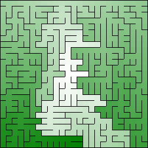

# Mazes for Programmers
Code Your Own Twisty Little Passages

&nbsp;
&nbsp;
&nbsp;
&nbsp;
&nbsp;
&nbsp;

## Java Implementation

In the book *[Mazes for Programmers](https://pragprog.com/titles/jbmaze/mazes-for-programmers/)* a Ruby implementation is given, but it can be implemented in many different programming languages. This repository contains a Java implementation.

Not everything from the book has been implemented yet! Check the [progress](progress.md).

Looking for another implementation? Check out these other [projects on GitHub](https://github.com/search?q=mazes+for+programmers)!

## About the Book

A [book on mazes](https://pragprog.com/titles/jbmaze/mazes-for-programmers/)? Seriously?

Yes!

Not because you spend your day creating mazes, or because you particularly like solving mazes.

But because it’s fun. Remember when programming used to be fun? This book takes you back to those days when you were starting to program, and you wanted to make your code do things, draw things, and solve puzzles. It’s fun because it lets you explore and grow your code, and reminds you how it feels to just think.

Sometimes it feels like you live your life in a maze of twisty little passages, all alike. Now you can code your way out.

---

From video games to movies, mazes are ubiquitous. Explore a dozen algorithms for generating these puzzles randomly, from Binary Tree to Eller’s, each copiously illustrated and accompanied by working implementations in Ruby. You’ll learn their pros and cons, and how to choose the right one for the job.

You’ll start by learning six maze algorithms and transition from making mazes on paper to writing programs that generate and draw them. You’ll be introduced to Dijkstra’s algorithm and see how it can help solve, analyze, and visualize mazes. Part 2 shows you how to constrain your mazes to different shapes and outlines, such as text, circles, hex and triangle grids, and more. You’ll learn techniques for culling dead-ends, and for making your passages weave over and under each other. Part 3 looks at six more algorithms, taking it all to the next level. You’ll learn how to build your mazes in multiple dimensions, and even on curved surfaces.

Through it all, you’ll discover yourself brimming with ideas, the best medicine for programmer’s block, burn-out, and the grayest of days. By the time you’re done, you’ll be energized and full of maze-related possibilities!

[Q&A with Jamis Buck, author of Mazes for Programmers](https://pragprog.com/titles/jbmaze/mazes-for-programmers/#qa-with-jamis-buck-author-of-mazes-for-programmers)
